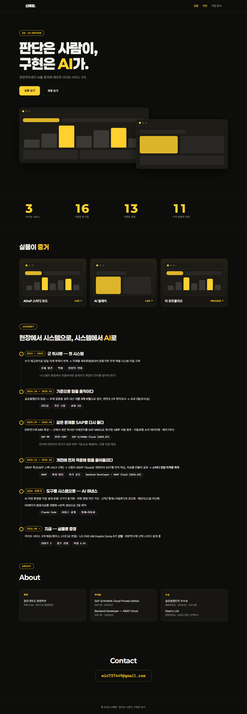

# 신해원 포트폴리오

케이스 스터디를 **버전 타임라인(의사결정 지도)** 으로 보여주는 개인 포트폴리오 웹앱.
"무엇을 만들었나"가 아니라 **"분기점마다 무엇을 정했고 무엇을 버렸나"** 를 남긴다.

**▶ 라이브: https://shw-portfolio.vercel.app**



## 무엇이 다른가

일반 포트폴리오가 결과물 스크린샷과 스택 나열로 끝나는 자리에, 이 앱은 프로젝트마다
**분기점 단위 타임라인**을 놓는다. 각 분기점은 네 칸으로 기록된다.

| 칸 | 내용 |
|---|---|
| 문제 | 그 시점에 실제로 막힌 것 |
| AI 활용 | 어떻게 썼고 무엇을 믿지 않았나 |
| 결정 | 채택한 안 |
| ⊘ 기각 | **버린 대안과 그 이유** — 보통 포트폴리오에서 사라지는 부분 |

수치는 실측값만 적는다.

## 스택

`Vite` · `React` · `TypeScript` · `Vercel`

문안은 코드에 하드코딩하지 않는다 — `content/*.md`가 원천이고 앱은 그것을 읽어 렌더한다.

## 로컬 실행

```bash
cd app
npm install
npm run dev      # 개발 서버
npm run build    # 타입체크 + 프로덕션 빌드
npm run lint     # oxlint
npm run test     # vitest
```

## 구조

```
app/        앱 본체 (Vite + React + TS)
content/    원고 md — 이 앱의 단일 원천
docs/       설계 문서 · 시안 · 뷰포트 캡처
SPEC.md     현행 개편 사양
```

라우트: `/` · `/case/:slug` · `/how`

검증 기준: 빌드·lint 클린 · 3뷰포트(390 / 1280 / 1920)에서 가로 오버플로우 0.

---

## 개발 상태

**현재상태** — 라이브 운영 중. 2026-08-12 재정의 SPEC 확정 후 콘텐츠 개편 진행 중이다.
축적(원천 md)과 노출(화면)을 분리해, 케이스를 빼는 일이 삭제가 아니라 frontmatter `노출: false`
한 줄이 되도록 설계했다. 원고를 신형식으로 이관 중이며(`content/cases/`) 구형 3건과 병존한다.
디자인(다크+옐로 토큰·타임라인 시그니처)은 이번 범위 밖으로 유지한다.

**다음 할 일**
1. SPEC §8 열린 항목 4건 오너 결정 — 원고 순서 / `본인` 프리셋 공개 여부 / letter-db 연동 수준 / 캠프 산출물 게재 경계
2. 구현 C1~C6 — 글롭 로딩 · frontmatter 파서 · 독자 프리셋 · 요약형 카드 · 자산 섹션 · 테스트
3. 원고 집필(오래된 것부터 — 동등 깊이, recency bias 금지)

상세 사양·기각 이력은 [`SPEC.md`](SPEC.md), 작업 로그는 [`작업기록.md`](작업기록.md).

---

코드는 참고하셔도 됩니다. 원고·이미지 등 포트폴리오 콘텐츠의 저작권은 보유합니다.
